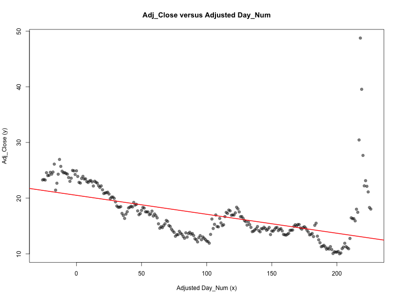
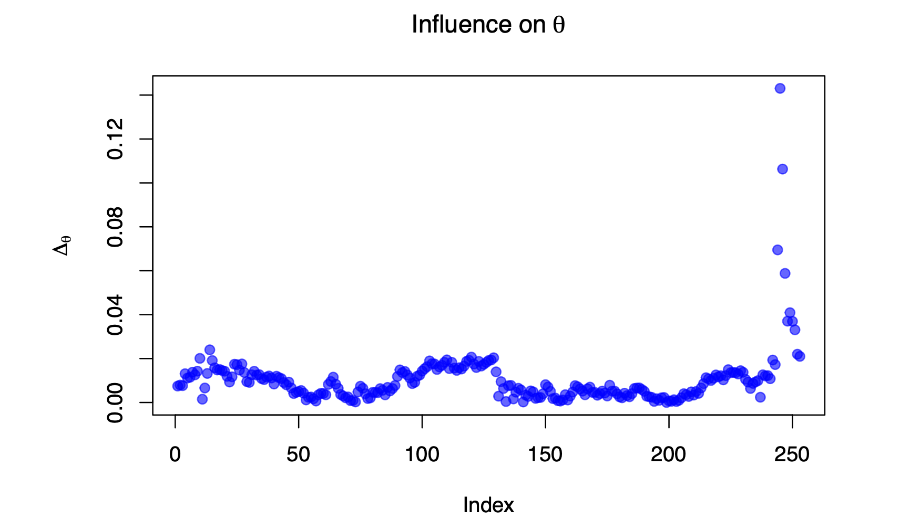

# GME Stock Volatility: A Data-Driven Analysis

## Project Overview
This project analyzes the daily stock prices of GameStop (GME) from May 24, 2023, to May 25, 2024. The objective is to explore stock volatility, identify influential trading days, and apply robust regression techniques to model the stock price trend over time. The dataset includes 253 trading days, and the analysis aims to uncover meaningful insights into stock price movements and outliers.

## Table of Contents
1. [Data Overview](#data-overview)
2. [Exploratory Data Analysis](#exploratory-data-analysis)
3. [Influence Analysis](#influence-analysis)
4. [Robust Regression](#robust-regression)
5. [Key Insights and Conclusions](#key-insights-and-conclusions)

## Data Overview
The dataset `GME.csv` contains daily stock information for GameStop (GME) over the specified time period. This data was sourced from **Yahoo Finance**, a popular platform for stock market information, including historical data on stock prices and trading volumes.

| **Variate**    | **Description**                                                                                |
|----------------|------------------------------------------------------------------------------------------------|
| **Date**       | A string recorded as YYYY-MM-DD, indicating the date of the trading day.                        |
| **Day_Num**    | An integer counter starting from 1 and ending at 253 (representing the trading days).           |
| **Open**       | The opening price of GME in US dollars on a given day.                                          |
| **High**       | The highest value of GME in US dollars on a given day.                                          |
| **Low**        | The lowest value of GME in US dollars on a given day.                                           |
| **Close**      | The closing price of GME in US dollars on a given day.                                          |
| **Adj_Close**  | The adjusted closing price of GME in US dollars on a given day (after adjustments for splits).  |
| **Volume**     | The total number of GME shares traded on that day.                                              |

---

## Exploratory Data Analysis
We begin by visualizing the trend in adjusted closing prices over time, using a scatter plot and fitting a linear regression line to identify the general trend.

### Visualizations:
- Scatter plot of adjusted closing price vs. trading day (Day_Num).
- Side-by-side comparison of linear regression and robust regression models.



**Figure 1**: Scatter plot showing the adjusted closing prices of GameStop over time (Day_Num). The red line represents the fitted linear regression line, which shows a general downward trend over time.

### Discussion:
- The scatter plot reveals a gradual decline in the adjusted closing price of GME over time. Some outlier days exhibit sharp price changes, especially around May 2024, when significant volatility is observed.

---

## Influence Analysis
To better understand which trading days had the most significant influence on the overall price trend, we calculate influence metrics and visualize the results. The four most influential days are highlighted in the following plots.

### Influence Plots:
- **Influence on Alpha (Intercept)**:
  
  

- **Influence on Beta (Slope)**:
  
  

- **Overall Influence on Parameters**:
  
  

**Figure 2**: Influence plots showing how individual trading days impacted the model's intercept (alpha) and slope (beta). A few key days had an outsized influence on the overall trend, particularly around May 2024.

### Discussion:
- The most influential trading days occurred around May 2024, when there was a sudden spike in stock price. These days significantly skew the slope (beta) of the linear regression model, contributing to the observed downward trend.

---

## Robust Regression
To mitigate the effect of outliers, we apply a robust regression technique using the Geman-McClure objective function. This method reduces the influence of extreme values and provides a more reliable estimate of the true trend in GME's adjusted closing price.

### Robust Regression Plot:
- **Robust Regression vs. Ordinary Least Squares (OLS)**:
  
  

**Figure 3**: A comparison between ordinary least squares (OLS) and robust regression models. The robust regression model (green line) is less influenced by outliers, providing a more stable trendline than the OLS model (red line).

### Discussion:
- The robust regression model provides a smoother trendline compared to OLS, which is heavily influenced by volatile trading days. This suggests that robust regression is better suited for analyzing GME's stock data, which includes significant outliers.

---

## Key Insights and Conclusions
- **Volatility**: GME's stock exhibited significant volatility, especially during certain periods in 2024, where sharp price increases and decreases were observed.
- **Influential Days**: A few specific trading days had an outsized impact on the overall trend, particularly in May 2024, when a sudden price spike distorted the general downward trend.
- **Robust Regression**: Applying robust regression helped mitigate the effect of outliers and provided a more accurate representation of GME's stock trend over time.

---

## So What?

The GameStop stock volatility has drawn significant attention due to its sharp price movements and unpredictable nature. This analysis not only helps to explain the specific case of GME’s stock but also offers broader lessons for analyzing other volatile stocks or financial assets. Understanding which trading days have the most influence on stock price trends is essential for both retail and institutional investors, as these outliers can dramatically affect long-term trends and strategies. The methods used in this project—such as influence analysis and robust regression—are critical tools that can be applied beyond this case study.

### Broader Applications of the Methods

- **Influence Analysis**: This approach can be used in any context where extreme observations or events disproportionately affect the results of a model. For example, influence analysis could be applied to other highly volatile stocks, such as those in the technology or cryptocurrency sectors, where sudden price changes are common. Understanding which specific days, trades, or events have the most impact allows analysts to more effectively discount noise and focus on meaningful trends.

- **Robust Regression**: In this project, robust regression was particularly useful in mitigating the effects of extreme price spikes that distorted the overall stock trend. This method can be applied across various fields where outliers are present, such as in financial markets, real estate, or even medical research. In any domain where data points may be subject to large fluctuations, robust regression helps create models that are less sensitive to outliers, providing more reliable and accurate predictions.

### Why I Did This Project

I undertook this project to deepen my understanding of advanced statistical modeling techniques, particularly robust regression, and how they can be applied to real-world data with high volatility and noise. The case of GameStop (GME) provided a fascinating, real-world example of stock market volatility, and by analyzing this dataset, I gained insights into how extreme events can affect overall trends.

In particular, this project taught me about:

- **Robust Regression**: The benefits of using robust regression when dealing with outlier-heavy data became clear during the analysis. By comparing ordinary least squares (OLS) with robust regression, I saw firsthand how robust methods can provide a much smoother and more accurate trendline in the presence of sharp, temporary stock price spikes. It’s a powerful technique for ensuring that important long-term trends are not overshadowed by short-term anomalies.

- **Gradient Descent**: To fit the robust regression model, I also learned about the gradient descent optimization technique, which is used to minimize the objective function in machine learning and regression models. Understanding how to implement this allowed me to appreciate how robust regression methods iteratively adjust model parameters to minimize the influence of outliers.
---

## Context: GameStop
GameStop is an American retailer specializing in video game hardware, video game software, video game accessories, mobile and consumer electronics, and pop culture merchandise. Since February 2002, GameStop shares have been publicly traded on the New York Stock Exchange under the ticker symbol “GME” (NYSE: GME). 

In 2020, a redditor named Keith Gill noticed that the GameStop stock was heavily shorted (primarily by institutional investors), even though the underlying fundamentals of the company didn’t support the theory that GameStop was about to go bankrupt. In January of 2021, the stock price jumped from $1/share to $5/share. This gained traction on Reddit, particularly among the redditors on the r/wallstreetbets subreddit. As a result, retail investors started buying into the stock at unprecedented rates anticipating a “short squeeze,” and this buying frenzy drove the stock price up to a peak value of $347.51/share on January 27, 2021.

Within a few weeks, the stock price had fallen dramatically (due in part to Robinhood halting the purchasing of the stock), but many retail investors who took advantage of the short squeeze profited handsomely. For instance, Keith Gill posted a final account update in April of 2021 showing that the value of his holdings had increased from $50,000 to $34,473,248.01. Sony Pictures made a movie about this saga.

In July of 2022, GameStop had a 4-for-1 stock split, multiplying its share count and decreasing the price. The stock closed at $153.47/share on the day of the split and reopened at $38.37/share. By April of 2024, the stock was trading under $11 per share. However, earlier this month, the GameStop share price spiked again, peaking on May 14 at $64.83 (an increase of roughly 500% from two weeks prior, and equivalent to $259.32 in pre-split prices). Speculation is rampant as to what caused the recent price increase, ranging from short sellers closing positions, regulatory changes, LEAP expiry, and the re-emergence of Keith Gill, who has recently begun posting on social media again after a several-year hiatus. However, no one actually knows why these significant price changes have occurred.

---

## Key Insights and Conclusions
- **Volatility**: GME's stock exhibited significant volatility, especially during certain periods in 2024, where sharp price increases and decreases were observed.
- **Influential Days**: A few specific trading days had an outsized impact on the overall trend, particularly in May 2024, when a sudden price spike distorted the general downward trend.
- **Robust Regression**: Applying robust regression helped mitigate the effect of outliers and provided a more accurate representation of GME's stock trend over time.

---

## How to Run the Project
To reproduce the analysis:
1. Clone the repository:
   ```bash
   git clone https://github.com/your-username/GME_Analysis_Project.git
   cd GME_Analysis_Project